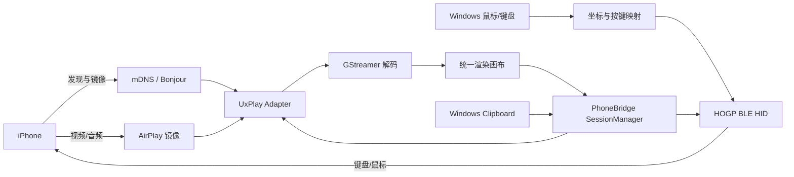
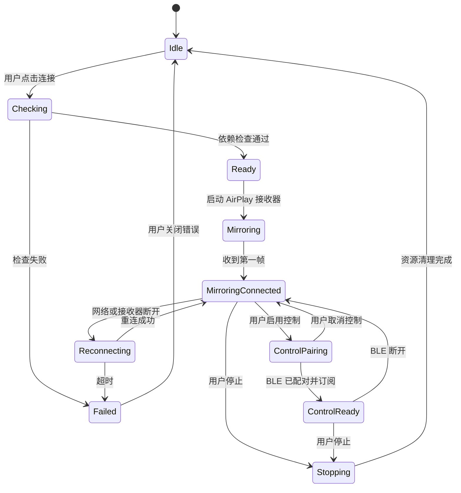

# PhoneBridge Windows → iPhone Spec v1.0

> 状态：Draft
> 版本：1.0
> 日期：2026-09-02
> 目标平台：Windows 10/11
> 桌面技术栈：Tauri 2 + Rust + React + TypeScript + Vite
> Design system：shadcn/ui + Tailwind CSS
> 语言：中文

## 1. 产品定义

PhoneBridge 是一个 Windows 桌面应用：接收 iPhone 的原生 AirPlay 镜像画面，并让 Windows 电脑在 iPhone 看来像一套 Bluetooth LE 键盘和鼠标，从而在同一窗口内完成观看、点击、键盘输入和文字粘贴。

### 1.1 MVP 结论

```text
                  iPhone
             ┌──────┴──────┐
             │             │
        AirPlay 镜像     BLE HID
             │             │
             ↓             ↑
       UxPlay 接收器   Windows BLE HID
             │             │
             └──────┬──────┘
                    ↓
             PhoneBridge UI
             Windows 10/11
```

MVP 采用两条独立链路：

- 画面：iPhone → AirPlay/mDNS/RTSP/RTP → UxPlay/GStreamer → Windows 渲染区域。
- 控制：Windows → HOGP/BLE HID → iPhone AssistiveTouch/键盘系统。
- 粘贴：Windows 剪贴板 → 文本编码器 → BLE HID 键盘事件；不是 Apple Universal Clipboard。

### 1.2 体验承诺与明确限制

| 项目 | MVP 承诺 | 限制或前置条件 |
|---|---|---|
| iPhone 投屏到 Windows | 支持同一局域网内的原生屏幕镜像 | 受 iOS 版本、网络、UxPlay 兼容性影响 |
| Windows 鼠标控制 iPhone | 支持移动、单击、拖拽、滚轮 | iPhone 需要启用“设置 → 辅助功能 → 触控 → AssistiveTouch”才能显示指针 |
| Windows 键盘输入 | 支持常用键、组合键和可编码文本 | iOS 键盘布局、输入法、Unicode/Emoji 需要逐项验证 |
| Windows → iPhone 文字粘贴 | 在投屏窗口获得焦点时支持 `Ctrl+V` 和“粘贴”按钮 | 以模拟键盘输入实现，不承诺读取或写入 iOS 系统剪贴板 |
| Apple Account | 不要求 iPhone 与 Windows 登录同一 Apple Account | 不使用 Apple 的 iPhone Mirroring 私有认证链路 |
| iPhone 配套 App | MVP 不需要安装 iOS App | 手机必须解锁并保持可见；锁屏、Face ID、受保护内容不纳入控制范围 |
| USB 投屏 | 不纳入 MVP | `ioscpy` 方案要求越狱 iPhone，只作为研究参考 |
| Android | 不纳入 MVP | 后续可通过 scrcpy/ADB 接入统一画布 |

### 1.3 非目标

- 不逆向或复制商业 Wormhole 的专有实现、品牌或界面资源。
- 不绕过 iOS 锁屏、Face ID、DRM、企业管理策略或用户授权。
- 不在 MVP 中实现真实的 iOS 系统剪贴板双向同步。
- 不承诺完整多点触控、系统级 Home/返回/多任务私有命令。
- 不将未经许可的第三方二进制、证书或密钥提交到仓库。

## 2. 用户流程

### 2.1 首次连接

1. 用户启动 PhoneBridge，应用运行本地诊断检查。
2. 应用检查 Windows 版本、网络、mDNS/Bonjour、Bluetooth LE Peripheral 能力和依赖版本。
3. 用户在 iPhone 打开“控制中心 → 屏幕镜像”，选择 PhoneBridge 接收器。
4. 应用显示连接状态和必要的 AirPlay PIN/密码提示。
5. 用户点击“启用控制”，应用短时开启 BLE HID 广播。
6. 用户在 iPhone 的蓝牙设备列表中选择 PhoneBridge Input，完成配对。
7. 用户按引导开启 AssistiveTouch；应用发送测试移动和单击事件。
8. 连接完成，主界面显示实时画面、设备状态、帧率和输入状态。

### 2.2 日常使用

- 鼠标在镜像画布内移动时，应用将画布坐标映射为手机坐标，并发送相对 HID 鼠标报告。
- 左键单击发送按下/释放；按住左键移动形成拖拽；滚轮发送滚动报告。
- 键盘事件只在镜像画布拥有焦点时转发，避免用户在其他 Windows 应用中误输入到手机。
- `Ctrl+V` 或工具栏“粘贴”读取 Windows 纯文本剪贴板，经大小、字符和敏感信息策略检查后发送键盘输入。
- 用户点击“停止控制”时，应用先释放所有按键/鼠标按钮，再关闭 BLE 广播。
- 用户点击“断开”时，应用终止镜像会话、关闭渲染器和子进程，并清理本次会话的网络/蓝牙状态。

### 2.3 异常恢复

| 情况 | 用户可见行为 | 应用行为 |
|---|---|---|
| Wi-Fi 短暂中断 | 显示“正在重连” | 保留 UI 状态，按退避策略重试；超过超时后提示重新镜像 |
| BLE 断开 | 显示“控制已断开，画面仍在” | 立即释放本地输入状态，停止广播并允许用户重新配对 |
| UxPlay 崩溃 | 显示“镜像引擎已停止” | 收集退出码和最近日志，允许一键重启，不自动重复弹窗 |
| 适配器不支持 Peripheral | 禁用“启用控制” | 明确显示 `Peripheral=False` 及解决建议 |
| 设备被其他接收器占用 | 显示“连接被拒绝或超时” | 提供重新发现、检查防火墙和 PIN 的诊断入口 |

## 3. 功能需求

优先级：P0 为 MVP 必须，P1 为首个稳定版本，P2 为后续扩展。

### 3.1 连接与镜像

| ID | 优先级 | 需求 | 验收标准 |
|---|---:|---|---|
| FR-CON-001 | P0 | 发现 AirPlay 接收器 | iPhone 在控制中心的“屏幕镜像”列表中看到 PhoneBridge；发现失败时诊断页能指出 mDNS/防火墙/网络原因 |
| FR-CON-002 | P0 | 建立镜像会话 | 用户选择接收器后能完成握手并在 Windows 显示第一帧；不要求同一 Apple Account |
| FR-CON-003 | P0 | 会话状态 | UI 至少显示发现、连接中、已连接、重连中、失败、已停止六种状态 |
| FR-CON-004 | P0 | 安全接入 | 支持 AirPlay PIN/密码或等效的用户确认策略；默认不接受任意局域网客户端长期连接 |
| FR-CON-005 | P0 | 断开清理 | 点击停止或进程退出后，子进程、网络端口、渲染管线和临时文件均被回收 |
| FR-MIR-001 | P0 | 实时画面 | 支持 iPhone 屏幕镜像画面进入统一渲染区域；参考设备上 720p 画面稳定达到 30 FPS |
| FR-MIR-002 | P0 | 方向与比例 | 支持竖屏、横屏、旋转和窗口缩放；不拉伸画面，必要时使用等比缩放和黑边 |
| FR-MIR-003 | P0 | 画面暂停/恢复 | 应用窗口最小化或切换后台时不崩溃；恢复后能继续渲染或明确提示会话已失效 |
| FR-MIR-004 | P1 | 音频 | 将镜像音频输出到 Windows 默认设备，并提供静音开关；音画同步问题要有诊断信息 |
| FR-MIR-005 | P1 | 录制 | 允许用户录制当前镜像画面到 MP4；录制前明确显示文件路径和隐私提醒 |

### 3.2 BLE HID 控制

| ID | 优先级 | 需求 | 验收标准 |
|---|---:|---|---|
| FR-HID-001 | P0 | 作为 BLE 外设广播 | 只有用户点击“启用控制”后才开始广播；停止控制后不可继续被新设备发现 |
| FR-HID-002 | P0 | iPhone 配对 | iPhone 能将 PhoneBridge 识别为输入设备并完成配对；应用显示已配对、已连接和未订阅状态 |
| FR-HID-003 | P0 | 鼠标移动 | 鼠标移动可转换为相对 HID 报告；坐标不越界，不因画布缩放产生明显跳变 |
| FR-HID-004 | P0 | 单击与拖拽 | 左键按下/释放顺序正确；应用失焦、断开或退出时强制释放按钮 |
| FR-HID-005 | P0 | 键盘输入 | 支持字母、数字、常用标点、退格、回车、Tab、Shift/Ctrl/Alt/Command 对应键和方向键 |
| FR-HID-006 | P0 | 滚轮 | 支持垂直滚动；滚动步长可配置且不会在断线重连后积压旧事件 |
| FR-HID-007 | P1 | 连接切换 | 只允许一个活动 iPhone 控制会话；切换设备前释放旧会话的全部按键和按钮 |
| FR-HID-008 | P1 | 诊断 | UI 能展示 BLE 外设能力、适配器名称、连接间隔、订阅状态和最近错误 |

### 3.3 文本粘贴

| ID | 优先级 | 需求 | 验收标准 |
|---|---:|---|---|
| FR-CLP-001 | P0 | 显式粘贴 | 工具栏“粘贴”按钮将 Windows 剪贴板纯文本发送到 iPhone 当前输入框 |
| FR-CLP-002 | P0 | 画布快捷键 | 镜像画布获得焦点时，`Ctrl+V` 触发同一粘贴流程；其他 Windows 应用不受影响 |
| FR-CLP-003 | P0 | 内容保护 | 默认不把剪贴板内容写入日志、不上传网络、不持久化到磁盘；用户可关闭自动读取 |
| FR-CLP-004 | P0 | 大小限制 | MVP 处理不超过 32 KiB 的纯文本；超出时提示用户并提供手动分段策略 |
| FR-CLP-005 | P0 | 字符反馈 | 对无法通过当前 HID 键盘布局表达的字符显示数量和位置，不静默丢失 |
| FR-CLP-006 | P1 | Unicode 优化 | 在验证 iOS 键盘布局和文本编码方案后支持更广泛 Unicode；Emoji/复杂输入法仍需单独验收 |

### 3.4 诊断与设置

| ID | 优先级 | 需求 | 验收标准 |
|---|---:|---|---|
| FR-DIAG-001 | P0 | 一键诊断 | 输出 Windows 版本、网络接口、mDNS、端口、防火墙、BLE Peripheral、依赖版本和最近错误 |
| FR-DIAG-002 | P0 | 可导出诊断包 | 诊断包只包含脱敏日志和环境信息，不包含画面、音频、剪贴板内容或认证材料 |
| FR-DIAG-003 | P0 | 用户控制权限 | 设置中可分别关闭自动控制、快捷键粘贴、音频和本地录制 |
| FR-DIAG-004 | P1 | 多设备列表 | 保存用户明确配对过的设备名称和非敏感标识；不保存未经用户确认的附近设备列表 |

## 4. 用户界面

### 4.1 主窗口

```text
┌──────────────────────────────────────────────┐
│ PhoneBridge                         ⚙  ● REC │
├────────────┬─────────────────────────────────┤
│ Devices    │                                 │
│            │          iPhone 镜像画布        │
│ ● iPhone   │                                 │
│   Connected│                                 │
│            │                                 │
│ + Add      │                                 │
├────────────┴─────────────────────────────────┤
│ Connected · 30 FPS · AirPlay · BLE HID       │
│  Mouse   Keyboard   Paste   Fullscreen       │
└──────────────────────────────────────────────┘
```

### 4.2 必须可见的状态

- 画面连接状态和最近错误。
- 控制状态：未启用、广播中、等待配对、已连接、输入可用、输入已暂停。
- 当前 FPS、分辨率和估算延迟；指标不可用时显示“未知”，不伪造数值。
- AssistiveTouch 提示只在控制会话第一次成功配对或检测到无指针时显示。
- 当前应用是否拥有画布焦点，避免用户误以为键盘已经发往手机。

### 4.3 快捷键

| 快捷键 | 行为 | 范围 |
|---|---|---|
| `Ctrl+V` | 读取 Windows 纯文本剪贴板并发送 | 仅镜像画布获得焦点时 |
| `Esc` | 退出全屏或停止当前拖拽 | 应用内 |
| `Ctrl+Alt+Pause` | 暂停/恢复输入转发 | 应用内，可在设置中禁用 |
| `Ctrl+Alt+Q` | 立即释放所有按键和鼠标按钮 | 应用内紧急操作 |

不注册全局键盘钩子作为 MVP 的默认行为；如未来支持全局快捷键，必须单独取得用户同意并显示权限状态。

### 4.4 Design system

`shadcn/ui` 是本项目的 Design system（按需求中的“shadui”指代）。组件源码直接纳入仓库并由项目维护，不把它当作黑盒 UI 包；React/Vite 项目使用 Tailwind CSS 和 CSS variables 统一主题。

- 视觉基线采用 shadcn/ui `new-york` 风格、Radix primitives、zinc/slate 中性基色和单一品牌强调色。
- 默认提供深色主题，同时保留浅色主题；基础表面必须使用 `bg-background`、`bg-card`、`text-foreground`、`text-muted-foreground`、`border-border` 和 `ring-ring` 等语义 token。
- 交互控件优先复用 `src/components/ui/` 中的 Button、Card、Badge、Tabs、Sheet、Dialog、AlertDialog、Tooltip、Skeleton、ScrollArea 和 Separator。
- 设备列表使用 `Card + Badge + DropdownMenu`；连接设置使用 `Tabs + Card + Switch/Select`；危险操作使用 `AlertDialog`；加载/错误/空状态使用 `Skeleton + Alert/Empty`。
- 不重复书写已有 shadcn/ui 交互原语的裸 `button`、`input`、`select` 或不可访问的 `div` 点击处理器。
- 组件必须支持键盘操作、焦点可见、屏幕阅读器标签和 Windows 高对比度/缩放；颜色不能是唯一的状态表达。
- 不在业务组件中散落任意 hex 颜色、随机圆角和间距；新增视觉 token 先写入主题 CSS 并说明用途。

## 5. 技术架构

### 5.1 推荐实现

- 桌面壳：Tauri 2.x，使用系统 WebView 承载前端；目标 Windows 10 2004（build 19041）及以上、Windows 11 x64/ARM64。
- 前端：React + TypeScript + Vite；页面、状态展示和交互编排放在 `src/`，不把操作系统能力直接放进 WebView。
- Design system：shadcn/ui + Tailwind CSS；组件源码位于 `src/components/ui/`，采用 CSS variables、`new-york` 风格和可访问 Radix primitives。
- 原生后端：Rust/Tauri commands 负责 `SessionManager`、子进程、BLE HID、剪贴板、诊断、防火墙和资源生命周期。
- 前后端通信：React 通过 Tauri `invoke` 调用受控命令，通过 Tauri events/channels 接收状态和指标；所有命令参数使用结构化序列化类型。
- 镜像接收：以 UxPlay 作为独立适配器，使用其 Windows 构建和 GStreamer 渲染能力；不要在业务层重新实现 AirPlay/FairPlay 协议。
- 控制输入：优先在 Rust 中通过 Windows WinRT `GattServiceProvider` 实现 HOGP；以 windows-ble-hid 的 HOGP/WinRT 行为作为参考。若 Spike 失败，才通过受限 sidecar 集成其可审查的 CLI，业务层不得依赖 CLI 文本输出。
- 镜像帧桥接：M0 必须验证 UxPlay/GStreamer 到 Tauri UI 的低延迟渲染路径，优先使用受控的 native frame bridge 或 Tauri channel；不假设 UxPlay 独立窗口可以直接嵌入 React DOM。
- Sidecar/本地 IPC：UxPlay 等外部进程只能通过 Tauri shell/process scope 启动；优先标准输入输出或受限本地通道传递结构化事件，禁止未认证的本地 TCP 管理端口。
- 日志：结构化本地日志，默认不记录剪贴板、屏幕内容、键盘原文和蓝牙配对材料。

### 5.2 数据流



### 5.3 模块边界

| 模块 | 实现位置 | 职责 | 不负责的内容 |
|---|---|---|---|
| `AppShell` | React + shadcn/ui | 窗口、导航、状态、权限提示和设置 | AirPlay/HID 协议细节 |
| `SessionManager` | Rust/Tauri | 会话状态机、启动/停止、重连和资源回收 | 直接解析视频包 |
| `MirrorAdapter` | Rust + UxPlay sidecar | 发现、启动 UxPlay、接收帧/音频/错误 | 鼠标键盘映射 |
| `RenderSurface` | React canvas/native frame bridge | 画面显示、比例、旋转、帧率统计 | 连接设备或配对 |
| `HidAdapter` | Rust/WinRT 或受限 sidecar | BLE 广播、配对状态、键盘/鼠标报告 | 画布坐标计算 |
| `InputMapper` | TypeScript/Rust 纯模块 | 画布坐标到手机坐标、按钮/滚轮/按键转换 | BLE 连接管理 |
| `ClipboardAdapter` | Rust/Tauri command | 读取纯文本、限长、字符能力检测和发送队列 | 读取 iOS 剪贴板 |
| `Diagnostics` | Rust + React view | 环境检查、脱敏日志、导出报告 | 自动修改系统设置而不告知用户 |
| `SecurityPolicy` | Rust/Tauri capabilities | PIN、允许设备、广播窗口、隐私开关 | 绕过系统权限 |

### 5.4 接口草案

接口是 React 与 Rust/Tauri 之间的稳定契约；命令名和事件名采用 snake_case，领域类型在前后端分别生成或校验，避免把原生错误字符串直接暴露给 UI。

```typescript
export interface BackendApi
{
  checkCapabilities(): Promise<CapabilityReport>
  startSession(options: StartSessionOptions): Promise<void>
  stopSession(): Promise<void>
  startControl(): Promise<void>
  stopControl(): Promise<void>
  releaseAllInput(): Promise<void>
  pastePlainText(): Promise<PasteResult>
}
```

前端调用示例：

```typescript
import { invoke } from "@tauri-apps/api/core"

const capability = await invoke<CapabilityReport>("check_capabilities")
await invoke("start_session", { options })
```

事件至少包括 `session://state`、`mirror://metadata`、`hid://status`、`diagnostic://error`；视频帧不得默认通过高频 JSON/base64 事件传输，具体帧桥接方式由 M0 的性能验证决定。

### 5.5 会话状态机



## 6. 关键实现规则

### 6.1 画面与坐标映射

1. 渲染区域记录实际内容矩形 `contentRect`，把黑边排除在可点击区域之外。
2. 根据当前手机视频宽高和方向计算 `scale = min(contentWidth / phoneWidth, contentHeight / phoneHeight)`。
3. 鼠标点先从窗口坐标减去内容矩形原点，再除以缩放比例，最后 clamp 到 `[0, phoneWidth] × [0, phoneHeight]`。
4. 旋转事件更新 viewport 后，清空旧的 hover/drag 计算，避免方向切换造成跳点。
5. HID 鼠标报告是相对移动；应用维护上一次目标点，并将大位移拆分为不超过 HID descriptor 上限的多个报告。
6. 鼠标移动事件采用有界队列；新事件可合并，按下/释放事件不可丢弃或重排。

### 6.2 键盘与粘贴

- 使用显式的物理键盘到 HID usage 的映射表，不依赖 Windows 本地化显示名称。
- KeyDown 和 KeyUp 必须成对；应用失焦、暂停、异常和断开时执行 `ReleaseAllAsync`。
- 粘贴流程只读取纯文本，不读取 HTML、文件列表或图片数据。
- `Ctrl+V` 只在画布有焦点时拦截；应用提供按钮作为可发现的替代入口。
- 文本编码器先处理安全的 ASCII/常用控制字符，再处理可验证的键盘布局字符；不能表达的字符必须返回失败位置。
- 粘贴队列有取消能力；用户停止控制后不应继续发送旧文本。

### 6.3 子进程与资源回收

- UxPlay 以受控子进程启动，记录版本、参数摘要、PID、退出码和脱敏 stderr。
- 所有启动参数由应用生成并做白名单校验，不直接拼接用户输入。
- 停止顺序固定为：暂停输入 → 释放按键/按钮 → 关闭 BLE 广播 → 停止镜像 → 关闭渲染器 → 删除临时文件。
- 子进程异常退出时，不自动继续发送鼠标键盘事件。
- 应用启动前检查端口和依赖，避免多个 UxPlay 实例互相占用资源。

## 7. 平台、依赖与许可证

### 7.1 基线依赖

| 依赖 | 用途 | 基线 | 许可证/状态 | 集成策略 |
|---|---|---|---|---|
| Tauri | Windows 桌面壳、Rust commands、权限和 sidecar 管理 | Tauri 2.x；精确版本锁定在 `Cargo.lock`/发布清单 | Rust 桌面框架 | 使用 capabilities、CSP 和最小插件权限，不开放任意 shell/filesystem |
| React + TypeScript + Vite | 前端界面、状态和构建 | Node.js LTS；精确版本锁定在 package lock | 前端运行时/构建工具 | 前端只负责 UI 与纯逻辑，系统能力统一走 Tauri API |
| shadcn/ui | Design system 和可访问 UI 原语 | `new-york`、Radix base、Tailwind CSS | 源码纳入项目；第三方 primitives 单独清单化 | 用 CLI 添加组件到 `src/components/ui/`，不复制为业务组件后失去来源记录 |
| UxPlay | AirPlay 镜像接收 | Windows 10/11 已有构建；首轮以 1.73+ 验证，精确版本随发布物固定 | GPLv3；官方仓库标注为开源，1.74 的内部 mDNS 仍属实验能力 | 独立适配器/子进程；发布前完成 GPL 义务和依赖清单审查 |
| GStreamer | UxPlay 音视频解码/渲染 | 与固定 UxPlay 构建匹配 | 多组件许可证 | 生成 SBOM 和第三方声明，不自行假设单一许可证 |
| windows-ble-hid | HOGP/BLE HID 参考实现 | Windows 10 2004（build 19041）+；需要支持 LE Peripheral 的适配器 | MIT；仓库自述称核心已在真实设备验证，但状态为 working spike | 优先参考 WinRT 行为并在 Rust 实现；必要时以受限 sidecar 集成 |
| Bonjour/mDNS | AirPlay 服务发现 | 取决于选定 UxPlay 构建 | Apple 组件与分发条款需单独审查 | 默认先走已验证路径；内部 mDNS 仅在 E2E 验证通过后启用 |
| AirPlayPC | Windows 集成/诊断参考 | 参考其安装、诊断、Firewall 和 AssistiveTouch 处理 | MIT；其核心仍依赖 UxPlay | 不把其脚本直接作为产品核心，选择性吸收诊断思路 |
| ioscpy | USB iPhone 研究参考 | 仅越狱 iPhone | MIT；项目明确限定为 jailbroken iPhone | 不进入 MVP，不把它描述成无越狱商业方案 |

### 7.2 许可证门槛

1. `UxPlay` 是 GPLv3。是否通过独立进程、下载器或插件边界满足产品分发要求，不能仅凭“进程分离”下结论；发布前必须由项目负责人和法律/开源合规人员确认。
2. 如分发 UxPlay、GStreamer 或 Bonjour，必须保留版权、许可证、源码获取方式和第三方声明。
3. 不复制第三方仓库中的代码、图标、脚本或测试数据，除非文件许可证、版权声明和目标发行模式已登记。
4. 每次升级外部依赖都记录版本、提交号、下载地址、SHA-256、许可证和已知兼容性。

## 8. 安全与隐私

### 8.1 威胁模型

| 资产 | 威胁 | 控制措施 |
|---|---|---|
| iPhone 画面和音频 | 局域网其他设备接收或窥视 | 默认同一广播域、PIN/密码、允许设备列表、明确的开始/停止状态 |
| BLE 控制权 | 附近设备在配对窗口抢先配对 | 仅按用户操作开启广播，缩短可配对窗口，显示设备名，配对后关闭可发现性 |
| Windows 剪贴板 | 敏感文字进入手机或日志 | 默认仅用户触发读取，不落盘、不上传、不写日志；支持关闭粘贴快捷键 |
| 键盘事件 | 按键粘滞或发送到错误设备 | 单一活动会话、焦点门控、断开时 Release All、紧急释放快捷键 |
| 第三方二进制 | 被替换或篡改 | 固定版本和 SHA-256，发布包签名，启动前校验版本和来源 |
| 诊断包 | 设备标识或网络信息泄露 | 默认脱敏 IP/MAC/UDID；导出前显示清单并要求确认 |

### 8.2 隐私原则

- MVP 不需要云端账户、远程服务器或 Apple Account。
- 不上传镜像帧、音频、键盘原文、剪贴板文本或配对数据。
- 日志记录事件类型和错误码，不记录输入内容。
- 录制、音频和剪贴板功能使用独立开关，并在执行前给出可见状态。
- 临时文件放入应用专属目录，退出后删除；无法删除时记录文件路径而不写入内容摘要。
- Tauri capabilities 只授予当前窗口所需的命令；shell/process、文件系统、剪贴板和 updater 权限均采用最小 scope。
- WebView 启用明确的 CSP；禁止把任意 URL、任意 shell 命令或未校验的本地路径传给 Rust 命令。

## 9. 性能与质量目标

以下是首轮验收目标，不代表所有设备上的硬性保证。

| 指标 | 目标 | 测量方式 |
|---|---:|---|
| 首帧时间 | P95 ≤ 5 秒 | 从用户确认镜像到第一帧可见 |
| 镜像帧率 | 参考配置 720p ≥ 30 FPS | 采集 5 分钟稳定会话的渲染统计 |
| 输入延迟 | 鼠标事件到画面反馈 P95 ≤ 150 ms | 使用可识别的屏幕测试目标和时间戳 |
| 重连时间 | 网络/蓝牙短断后 P95 ≤ 15 秒 | 注入一次短时断链并统计恢复 |
| 资源占用 | 参考配置下应用自身内存 ≤ 300 MB；CPU 目标 ≤ 30% | 不含操作系统后台服务，按 5 分钟窗口平均 |
| 稳定性 | 8 小时镜像会话无崩溃、无持续内存增长 | 参考 iPhone、Windows 和 BLE 适配器组合 |
| 键鼠安全 | 100% 测试用例无 stuck key/button | 断开、失焦、异常、停止、重连路径全部验证 |

参考配置应固定为一台 Windows 11 x64、16 GB RAM、Intel/AMD 近三年 CPU、一枚明确支持 LE Peripheral 的蓝牙适配器和一台实际 iPhone，并在测试报告中记录型号与版本。

## 10. 测试与验收

### 10.1 测试层级

| 层级 | 内容 | 必须覆盖 |
|---|---|---|
| 单元测试 | 坐标映射、旋转、HID 报告、键盘映射、文本限长、状态机 | 边界值、空输入、超长输入、负坐标、断链 |
| 组件测试 | MirrorAdapter、HidAdapter、ClipboardAdapter 的契约 | 模拟依赖缺失、子进程退出、订阅变化、超时 |
| 集成测试 | 真实 UxPlay、真实 BLE 适配器、真实 iPhone | 发现、镜像、配对、点击、键盘、粘贴、停止 |
| 回归测试 | Windows 10/11、x64/ARM64、不同蓝牙芯片 | 版本升级和驱动变化 |
| 安全测试 | 防火墙、配对窗口、日志和诊断包检查 | 无明文剪贴板/键盘/认证材料泄露 |

### 10.2 MVP 验收用例

| ID | 步骤摘要 | 通过条件 |
|---|---|---|
| AT-001 | Windows 与 iPhone 在同一 Wi-Fi，打开屏幕镜像 | PhoneBridge 出现在列表中并显示第一帧 |
| AT-002 | 关闭 Bonjour 或阻断 mDNS 后运行诊断 | 诊断准确指出服务发现失败，不显示模糊的“未知错误” |
| AT-003 | 使用支持 Peripheral 的适配器启用控制 | iPhone 能配对 HID，应用显示控制可用 |
| AT-004 | 未开启 AssistiveTouch 时移动鼠标 | 应用显示引导；开启后指针出现并跟随移动 |
| AT-005 | 点击、拖拽、滚轮和快速移动 | 事件顺序正确，无跳点、卡键或 stuck button |
| AT-006 | 在 iPhone 文本框中输入常用英文、数字、标点 | 字符与预期一致，KeyDown/KeyUp 成对 |
| AT-007 | Windows 复制 1 KiB 纯文本后按 `Ctrl+V` | iPhone 输入框出现相同文本，Windows 剪贴板保持不变 |
| AT-008 | 粘贴超 32 KiB 或包含无法编码字符 | 用户得到明确提示，不静默截断或继续发送 |
| AT-009 | 窗口失焦、断开网络、拔出蓝牙适配器 | 输入立即暂停并释放全部键鼠状态 |
| AT-010 | 停止会话后重新连接 | 旧进程和广播已清理，新会话能正常启动 |
| AT-011 | 导出诊断包并解压检查 | 不含画面、音频、剪贴板文本、键盘原文或认证材料 |
| AT-012 | 播放受保护视频内容 | 应用稳定并显示受支持范围限制，不尝试绕过 DRM |

### 10.3 兼容性矩阵

首个可发布版本至少记录以下组合；未实测组合不得标记为“支持”。

| 维度 | 最低覆盖 |
|---|---|
| Windows | Windows 10 2004/22H2、Windows 11 最新稳定版；x64，ARM64 为增强项 |
| Bluetooth | 内置 Intel、已知可用 USB 适配器、一个不支持 Peripheral 的适配器 |
| 网络 | 家庭路由器、企业隔离 Wi-Fi、无 mDNS 的网络、Windows 防火墙开启 |
| iPhone | 至少两代硬件、竖屏/横屏、AssistiveTouch 开关、不同键盘布局 |
| 状态 | 首次配对、已配对重连、应用重启、睡眠唤醒、手机锁屏/解锁 |

## 11. 交付阶段

### 11.1 M0：可行性 Spike

交付一份可重复的实验记录和最小命令行验证：

- 确认目标蓝牙适配器报告 `Peripheral=True`。
- iPhone 能配对 BLE HID，键盘输入有效，开启 AssistiveTouch 后指针有效。
- UxPlay 在同一网络发现 iPhone 并连续镜像 10 分钟。
- 完成 Tauri + React + Vite 的最小窗口，并验证 UxPlay/GStreamer 帧能以可接受延迟进入 React 渲染面；若不能，形成 native overlay/frame bridge 决策。
- 用 shadcn/ui 完成 Button、Card、Badge、Alert、Skeleton 五个基础组件和主题 token 验证。
- 完成画布坐标到手机坐标的离线测试。
- 记录 UxPlay、GStreamer、Windows、iOS、蓝牙驱动和适配器版本。

M0 未通过时，不进入 UI 开发；先替换适配器、固定 UxPlay 构建或缩小兼容范围。

### 11.2 MVP：单设备可用

- Tauri + React + Vite 主窗口、设备状态和诊断页；界面使用 shadcn/ui 组件和主题 token。
- 一个 iPhone 的 AirPlay 镜像、画面缩放和方向处理。
- BLE HID 鼠标、键盘、滚轮、释放全部状态。
- 画布内 `Ctrl+V`、粘贴按钮、ASCII/常用字符反馈。
- 启停、错误恢复、脱敏日志和第三方依赖清单。
- 完成 AT-001 至 AT-012，并在兼容性矩阵中填入真实设备。

### 11.3 V1：稳定性与内容能力

- 音频输出、录制、全屏、更多键盘布局。
- 已配对设备管理和更完整的自动重连。
- 可选的多设备列表，但仍只允许一个活动控制会话。
- 更新器、代码签名、SBOM、崩溃报告的本地脱敏导出。

### 11.4 V2：统一移动设备工作台

- Android 通过 scrcpy/ADB 接入相同的 `MirrorAdapter` 与 `InputMapper` 抽象。
- 3D 手机外壳、倾斜、缩放、鼠标动画和屏幕录制模板。
- iOS USB 只在有合法、无需越狱且可分发的实现被验证后重新评估；`ioscpy` 不作为商业产品依赖。
- 文件传输、通知和真正的双向剪贴板需要独立的协议和隐私评审，不从 MVP 的文字粘贴推导出系统剪贴板同步。

## 12. 方案依据与决策路径

| Evidence（依据） | Finding（结论） | Path（对产品的影响） |
|---|---|---|
| [UxPlay 官方仓库](https://github.com/FDH2/UxPlay) 标明 GPLv3、支持 Windows 10/11，并使用 AirPlay 镜像与 GStreamer；其内部 mDNS 方案仍有实验属性 | UxPlay 适合承担镜像接收，但版本、发现方式和分发义务必须固定 | 将 UxPlay 放在 `MirrorAdapter` 后，先采用已验证 Windows 构建，发布前完成许可证审查 |
| [windows-ble-hid 官方仓库](https://github.com/abhishek-raj/windows-ble-hid) 标明 Windows 10 2004+、LE Peripheral 角色要求，并报告 iPhone 配对/输入可用；指针需要 AssistiveTouch | Windows 蓝牙能力取决于 Peripheral 角色，不能只看“Bluetooth 4/5”宣传 | M0 先做能力探测；控制链路独立于 AirPlay；UI 必须提示 AssistiveTouch |
| [AirPlayPC 官方仓库](https://github.com/gbulog/pcairplay) 将 AirPlay 视频与 AssistiveTouch 输入分开，并明确手机需解锁、受保护锁屏/真实多点触控/系统剪贴板不在其范围 | “投屏 + HID 控制”不等同于 Apple 官方 iPhone Mirroring，也不是原生剪贴板同步 | 产品文案、验收条件和隐私说明必须避免过度承诺 |
| [ioscpy 官方仓库](https://github.com/lautarovculic/ioscpy) 明确为越狱 iPhone 的 USB 镜像与控制 | USB 路线不满足无越狱的 MVP 目标 | 仅保留为技术研究参考，不作为当前产品依赖 |
| [Tauri 官方文档](https://v2.tauri.app/start/) 明确支持 HTML/CSS/JavaScript 前端、Rust 后端、`invoke` 绑定及 capabilities/permissions | 系统级能力应位于 Rust/Tauri 边界，WebView 只负责界面和受控调用 | 采用 Tauri commands/events/channels，限制 shell、文件系统和本地进程权限 |
| [shadcn/ui Vite 安装文档](https://ui.shadcn.com/docs/installation/vite) 明确支持 Vite，并将组件源码添加到项目中，配合 Tailwind 和 `@/*` alias | Design system 需要可维护的源码归属和统一 token，而不是仅引入一个运行时 UI 包 | 固定 `src/components/ui/`、Tailwind CSS variables、组件 CLI 流程和可访问性要求 |

## 13. 开放决策门

以下事项在进入稳定发布前必须形成书面结论：

1. 选择 UxPlay 的具体版本、Windows 构建来源、GStreamer 打包方式和 mDNS 路径。
2. 确定 PhoneBridge 的整体许可证与 UxPlay GPLv3 的分发边界。
3. 确定应用是否分发 Bonjour，以及在没有 Bonjour 的网络中是否启用 UxPlay 内部 mDNS。
4. 确定 HOGP 代码是以 MIT 项目为基础改造、独立重写，还是通过外部进程集成。
5. 固定最小 iOS 版本、首批支持的蓝牙适配器和 Windows 版本，并将实测结果写入兼容性矩阵。
6. 决定是否把录制、音频和多设备管理延后到 V1；这些功能不应阻塞 MVP 的镜像与控制闭环。

## 14. 参考资料

- [UxPlay](https://github.com/FDH2/UxPlay)：AirPlay 镜像接收器，GPLv3。
- [windows-ble-hid](https://github.com/abhishek-raj/windows-ble-hid)：Windows BLE HOGP 键盘/鼠标参考实现，MIT。
- [AirPlayPC](https://github.com/gbulog/pcairplay)：Windows/Arch 集成与诊断参考，MIT。
- [ioscpy](https://github.com/lautarovculic/ioscpy)：越狱 iPhone USB 镜像/控制研究参考，MIT。
- [Tauri](https://v2.tauri.app/start/)：Tauri 2 桌面框架与 Rust/前端 IPC 文档。
- [shadcn/ui Vite](https://ui.shadcn.com/docs/installation/vite)：Vite 项目的 shadcn/ui、Tailwind 和组件安装文档。
